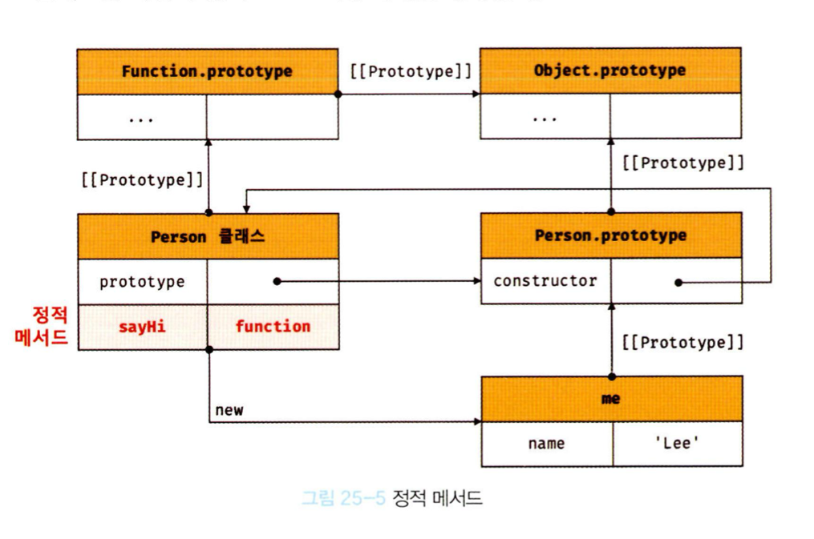

# 25장 클래스

## 25.1 클래스는 프로토타입의 문법적 설탕인가?

자바스크립트는 프로토타입 기반 객체지향 언어이다.

프로토타입 기반 객체지향 언어는 클래스가 필요 없는 객체지향 프로그래밍 언어이다.

ES5 -> 클래스 없이도 생성자 함수와 프로토타입을 통해 객체지향 언어의 상속을 구현할 수 있다.

ES6 -> 클래스 기반 객체지향 프로그래밍 언어와 매우 흡사한 새로운 객체 생성 메커니즘

하지만 기존의 프로토타입 기반 모델을 폐지한 것은 아니다.

클래스는 함수이며 프로토타입 기반 패턴을 클래스 기반 패턴처럼 사용할 수 있도록 하는 문법적 설탕이라 볼 수 있다.

생성자 함수와 클래스는 프로토타입 기반의 객체지향을 구현했다는 점에서 매우 유사.

하지만 클래스는 생성자 함수 기반의 객체 생성 방식보다 견고하고 명료하다.

클래스 -> 단순한 문법적 설탕이 아니라 새로운 객체 생성 메커니즘으로 보는 것이 더 합당하다.

## 25.2 클래스 정의

class 키워드를 사용하여 정의한다.

class Person {}

클래스를 표현식으로 정의할 수 있다는 것은 클래스가 값으로 사용할 수 있는 일급 객체라는 것을 의미한다.

클래스는 일급 객체로서 다음 특징이 있다.

- 무명의 리터럴로 생성할 수 있다. 즉, 런타임에 생성이 가능하다.
- 변수나 자료구조(객체, 배열 등)에 저장할 수 있다.
- 함수의 매개변수에게 전달할 수 있다.
- 함수의 반환값으로 사용할 수 있다.

클래스 몸체에는 0개 이상의 메소드만 정의할 수 있다. (메소드는 3가지 - 생성자, 프로토타입 메소드, 정적 메소드)

## 25.3 클래스 호이스팅

클래스는 함수로 평가된다.

클래스 선언문으로 정의한 클래스는 함수 선언문과 같이 소스코드 평가 과정, 즉 런타임 이전에 먼저 평가되어 함수 객체를 생성한다.

이때 클래스가 평가되어 생성된 함수 객체는 생성자 함수로서 호출할 수 있는 함수 = constructor이다.

클래스는 클래스 정의 이전에 참조할 수 없다.

클래스 선언문은 마치 호이스팅이 발생하지 않는 것처럼 보이나 그렇지 않다.

```javascript
const Person = "";

{
  // 호이스팅이 발생하지 않는다면 ''이 출력되어야 한다.
  console.log(Person);
  // 하지만 ReferenceError가 발생

  class Person {}
}
```

클래스 선언문도 변수 선언, 함수 정의와 마찬가지로 호이스팅이 발생한다.

단, 클래스는 let, const 키워드로 선언한 변수처럼 호이스팅된다.

따라서 클래스 선언문 이전에 일시적 사각지대에 빠지기 때문에 호이스팅이 발생하지 않는 것처럼 동작한다.

var, let, const, function\*, class 키워드를 사용하여 선언된 모든 식별자는 호이스팅된다.

모든 선언문은 런타임 이전에 실행되기 때문.

## 25.4 인스턴스 생성

> 클래스는 생성자 함수이며 new 연산자와 함께 호출되어 인스턴스를 생성한다.

클래스는 인스턴스를 생성하는 것이 유일한 존재 이유이므로 반드시 new 연산자와 함께 호출해야한다.

```javascript
class Person {}
// 인스턴스 생성
const me = new Person();
console.log(me);
```

식별자를 사용해 인스턴스를 생성하지 않고 기명 클래스 표현식의 클래스 이름을 사용해 인스턴스를 생성하면 에러가 발생한다.

기명 함수 표현식과 마찬가지로 클래스 표현식에서 사용한 클래스 이름은 외부 코드에서 접근 불가능하기 때문이다.

## 25.5 메서드

클래스 몸체에는 0개 이상의 메소드만 선언할 수 있다.

클래스 몸체에서 정의할 수 있는 메소드는 constructor(생성자), 프로토타입 메소드, 정적 메소드의 세가지가 있다.

### 25.5.1 constructor

constructor는 인스턴스를 생성하고 초기화하기 위한 특수한 메소드이다.

constructor는 이름을 변경할 수 없다.

```javascript
class Person {
  // 생성자
  constructor(name) {
    // 인스턴스 생성 및 초기화
    this.name = name;
  }
}
```

클래스는 평가되어 함수 객체가 된다. 클래스도 함수 객체 고유의 프로퍼티를 모두 갖고 있다. 함수와 동일하게 프로토타입과 연결되어 있으며 자신의 스코프 체인을 구성한다.

모든 함수 객체가 가지고 있는 prototype 프로퍼티가 가리키는 프로토타입 객체의 constructor 프로퍼티는 클래스 자신을 가리키고 있다. 이는 클래스가 인스턴스를 생성하는 생성자 함수라는 것을 의미한다.

즉 new 연산자와 함께 클래스를 호출하면 클래스는 인스턴스를 생성한다.

클래스 몸체에 정의한 construtor가 단순한 메소드가 아니다.

constructor는 메소드로 해석되는 것이 아니라 클래스가 평가되어 생성한 함수 객체 코드의 일부가 된다.

클래스 정의가 평가되면 constructor의 기술된 동작을 하는 함수 객체가 생성된다.

클래스의 constructor 메소드와 프로토타입의 constructor 프로퍼티는 이름이 같아 혼동하기 쉽지만 직접적인 관련이 없다.

constructor는 생성자 함수와 유사하지만 차이점이 존재한다.

- constructor는 클래스 내에 최대 한 개만 존재할 수 있다. 만약 클래스가 2개 이상의 constructor를 포함하면 문법 에러가 발생한다.
- constructor는 생략할 수 있다. / 빈 constructor가 암묵적으로 정의된다. constructor를 생략한 클래스는 빈 constructor에 의해 빈 객체를 생성한다.

### 25.5.2 프로토타입 메서드

생성자 함수를 사용하여 인스턴스를 생성하는 경우 프로토타입 메소드를 생성하기 위해서는 명시적으로 프로토타입에 메소드를 추가해야한다.

```javascript
// 생성자 함수
function Person(name) {
  this.name = name;
}

// 프로토타입 메소드
Person.prototype.sayHi = function () {
  console.log("");
};

const me = new Person("Lee");
me.sayHi();
```

클래스 몸체에서 정의한 메소드는 생성자 함수에 의한 객체 생성 방식과는 다르게 클래스의 prototype 프로퍼티에 메소드를 추가하지 않아도 기본적으로 프로토타입 메소드가 된다.

프로토타입 체인은 기존의 객체 생성 방식 뿐만 아니라 클래스에 의해 생성된 인스턴스에도 동일하게 적용된다. 생성자 함수의 역할을 클래스가 할 뿐이다.

클래스는 생성자 함수와 같이 인스턴스를 생성하는 생성자 함수라고 볼 수 있다. 클래스 -> 프로토타입 기반의 객체 생성 메커니즘.

### 25.5.3 정적 메서드

정적 메소드는 인스턴스를 생성하지 않아도 호출할 수 있는 메소드를 말한다.

생성자 함수의 경우 정적 메소드를 생성하기 위해서는 다음과 같이 명시적으로 생성자 함수에 메소드를 추가해야한다.

```javascript
function Person(name) {
  this.name = name;
}

// 정적 메소드
Person.sayHi = function () {
  console.log("Hi");
};

Person.sayHi();
```

클래스에서는 메소드에 static 키워드를 붙이면 정적 메소드가 된다.

```javascript
class Person {
  constructor(name) {
    this.name = name;
  }
  // 정적 메소드
  static sayHi() {
    console.log("Hi");
  }
}
```

위의 Person 클래스는 다음과 같이 프로토타입 체인을 생성한다.


정적 메소드는 클래스에 바인딩된 메소드가 된다. 클래스는 함수 객체로 평가되므로 자신의 프로퍼티/메소드를 소유할 수 있다. 클래스는 클래스 정의가 평가되는 시점에 함수 객체가 생성되므로 인스턴스와 달리 별다른 생성 과정이 필요 없다. 따라서 정적 메소드는 클래스 정의 이후 인스턴스를 생성하지 않아도 호출 할 수 있다.

== 정적 메소드는 프로토타입 메소드 처럼 인스턴스로 호출하지 않고 클래스로 호출한다.

-> 인스턴스의 프로토타입 체인 상에는 클래스가 존재하지 않기 때문에 인스턴스로 클래스의 메소드를 상속 받을 수 없다.

### 25.5.4 정적 메서드와 프로토타입 메서드의 차이

1. 정적 메소드와 프로토타입 메소드는 자신이 속해 있는 프로토타입 체인이 다르다.
2. 정적 메소드는 클래스로 호출하고 프로토타입 메소드는 인스턴스로 호출한다.
3. 정적 메소드는 인스턴스 프로퍼티를 참조할 수 있지만 프로토타입 메소드는 인스턴스 프로퍼티를 참조할 수 있다.

### 25.5.5 클래스에서 정의한 메서드의 특징

1. function 키워드를 생략한 메소드 축약 표현을 사용한다.
2. 객체 리터럴과는 다르게 클래스에 메소드를 정의할 때는 콤마가 필요 없다.
3. 암묵적으로 strict mode로 실행된다.
4. for ... in 문이나 Object.keys 메소드 등으로 열거할 수 있다. 즉, 프로퍼티의 열거 가능 여부를 나타내며, 불리언 값을 갖는 프로퍼티 어트리뷰트의 값이 false이다.
5. 내부 메소드 [[Construct]]를 갖지 않는 non-constructor이다. 따라서 new 연산자와 함께 호출할 수 없다.

## 25.6 클래스의 인스턴스 생성 과정

new 연산자와 함꼐 클래스를 호출하면 생성자 함수 처럼 클래스의 내부 메소드 [[Constructor]]가 호출된다. 클래스는 new 연산자 없이 호출할 수 없다.

### 1. 인스턴스 생성과 바인딩

new 연산자와 함께 클래스를 호출하면 constructor 내부 코드가 실행 -> 암묵적으로 빈 객체 생성

빈 객체가 클래스가 생성한 인스턴스(미완) -> 클래스가 생성한 인스턴스의 프로토타입으로 클래스의 prototype 프로퍼티가 가리키는 객체가 설정된다. 인스턴스는 this에 바인딩된다.

-> constructor 내부의 this는 클래스가 생성한 인스턴스를 가리킨다.

### 2. 인스턴스 초기화

constructor 내부 코드가 실행되어 this에 바인딩되어 있는 인스턴스를 초기화한다. 즉, this에 바인딩 되어 있는 인스턴스에 프로퍼티를 추가하고 constructor가 인수로 전달받은 초기값으로 인스턴스의 프로퍼티 값을 초기화한다. 만약 constructr가 생략되었다면 이 과정도 생략된다.

### 3. 인스턴스 반환

클래스의 모든 처리가 끝나면 완성된 인스턴스가 바인딩된 this가 암묵적으로 반환된다.
